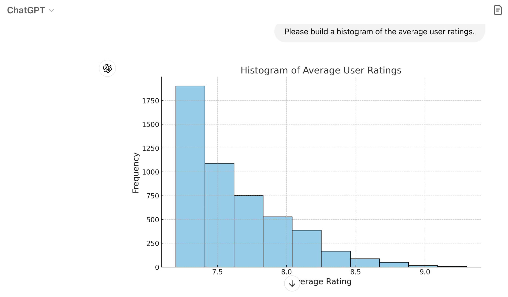

# Conversation Log

## User Prompt

What are the key steps to take in an emergency situation?

## Assistant Response

To handle an emergency situation based on the guidance from the manual provided, follow these steps:

1. **Stop Safely**: 
   - Pull over to a safe location on a hard, flat surface.
   - Set the parking brake and shift the gear to the "Park" position.
   - Turn off the engine and activate the emergency flashers.

2. **Assess the Situation**: 
   - Check for warning lights or messages on the dashboard. Follow the corrective actions indicated. For instance:
     - If the coolant temperature is high, stop the vehicle and inspect for leaks after cooling down.
     - If the engine oil pressure is low or other critical messages appear, stop immediately and seek professional assistance.

3. **Handle Specific Issues**:
   - **Flat Tire**: Replace it with the spare tire using the vehicle jack and tools. Ensure the spare is installed securely.
   - **Engine Overheating**: Let the engine cool before inspecting. Avoid opening the coolant reservoir if the engine is hot.
   - **Battery Issues**: Use jumper cables cautiously, ensuring proper connections to avoid sparks.

4. **Seek Assistance if Needed**: 
   - Use connected services or call for roadside assistance if available.
   - If towing is necessary, follow the appropriate procedures to avoid damage to the vehicle.

5. **Stay Calm and Communicate**:
   - If stranded or in a hazardous location, notify emergency services. Use tools like emergency hammers to exit the vehicle if submerged in water.

Would you like detailed instructions for any specific issue mentioned?

## User Prompt

What is the recommended tyre pressure in summer and winter?

## Assistant Response

The recommended tire pressures for the Land Cruiser 300 are as follows, based on tire size and speed limits:

1. **20-inch tires**:
   - **Speeds ≤ 160 km/h (99 mph)**: 230 kPa (2.3 bar, 33 psi) for both front and rear tires.
   - **Speeds > 160 km/h (99 mph)**: Front tires at 230 kPa (2.3 bar, 33 psi), rear tires at 260 kPa (2.6 bar, 38 psi).

2. **18-inch tires**:
   - Recommended cold inflation pressure: 230 kPa (2.3 bar, 33 psi) for both front and rear tires.

3. **17-inch tires**:
   - Recommended cold inflation pressure: 230 kPa (2.3 bar, 33 psi) for both front and rear tires.

These pressures are applicable year-round. Adjustments may be needed in extreme conditions (e.g., significant altitude or temperature changes). Always ensure the tires are cold when measuring pressure.

---

## Screenshots

### Emergency Steps

### Tire Pressure Recommendations

---

## Link

[Download the PDF of the Land Cruiser 300 Owner's Manual](https://toyotamanuals.com.au/docs/landcruiser-300-owners-manual-jul-21-current/)

## User Prompt

Please build a histogram of the average user ratings.

## Assistant Response

A histogram of the average user ratings was created, showing the distribution of ratings in the dataset. The frequency of movies within each rating range is visualized.

### Histogram

---

## Link

[Download the CSV of the IMDB Movies Dataset](https://www.kaggle.com/datasets/hetbabariya/imdb-movies-data-collection-5000-records?resource=download)